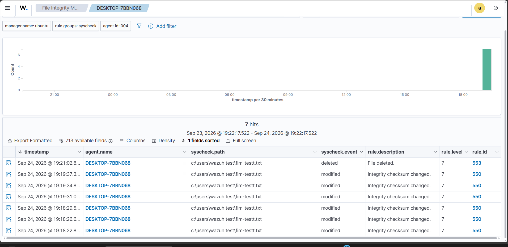

# File Integrity Monitoring

## Objective

Configure Wazuh to monitor a Windows directory for file changes.

## Monitored Directory

```text
C:\Users\Wazuh Test
```

## Configuration

The following configuration was added to the Windows Wazuh Agent:

```xml
<directories realtime="yes">C:\Users\Wazuh Test</directories>
```

The Wazuh Agent was restarted after configuration changes.

## Tests

### File Creation

A file was created inside:

```text
C:\Users\Wazuh Test
```

Wazuh detected the creation.

### File Modification

The file contents were changed.

Wazuh detected the modification.

### File Deletion

The file was deleted.

Wazuh recorded the deletion event.

## Result

Real-time FIM successfully detected:

## Evidence



```text
Create → Modify → Delete
```

This demonstrated endpoint file-change monitoring using Wazuh.
