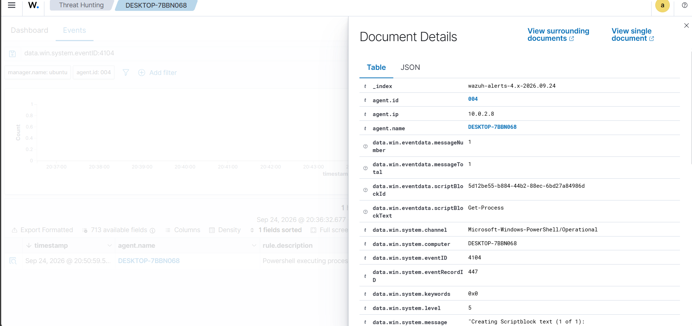

# PowerShell Monitoring

## Objective

Collect PowerShell Operational events and detect PowerShell activity.

## PowerShell Operational Channel

The following configuration was added to the Windows Wazuh Agent:

```xml
<localfile>
  <location>Microsoft-Windows-PowerShell/Operational</location>
  <log_format>eventchannel</log_format>
</localfile>
```

The Wazuh Agent was restarted after the configuration change.

## Script Block Logging

PowerShell Script Block Logging was enabled using the Windows Registry.

The registry path was:

```text
HKLM\SOFTWARE\Policies\Microsoft\Windows\PowerShell\ScriptBlockLogging
```

The setting was:

```text
EnableScriptBlockLogging = 1
```

The registry setting was verified using:

```powershell
reg query "HKLM\SOFTWARE\Policies\Microsoft\Windows\PowerShell\ScriptBlockLogging"
```

## PowerShell Event 4104

A PowerShell command was executed and Windows generated:

```text
Event ID: 4104
```

## Process Discovery Test

The following command was tested:

```powershell
Get-Process | Where-Object {$_.CPU -gt 0}
```

Wazuh detected the activity using:

```text
Rule: 91815
Description: Powershell executing process discovery
```

## Result

PowerShell Script Block Logging and Wazuh PowerShell detection were successfully demonstrated.

## Evidence


